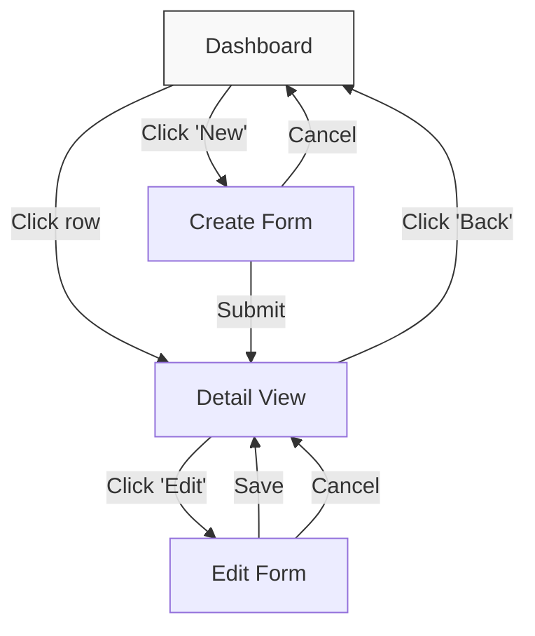

# Prototype Builder

## When to Use

- Creating clickable prototypes for new features before implementation
- Exploring user flows and navigation patterns
- Presenting design concepts to stakeholders
- Iterating on UI designs based on feedback
- Building directly from a Confluence page or spec URL

## Audience & Defaults

This skill is optimized for Product Managers building concept prototypes. Default to wireframe fidelity unless the user explicitly asks for high-fi. Infer reasonable defaults from the requirements rather than asking excessive questions. If the user provides specific hex colors, pixel values, or font names, do not use them literally — map to the closest design token instead. The design system is the source of truth for all visual decisions.

## Input Sources

This skill accepts requirements from multiple sources:

| Source | How to Provide | What Happens |
|--------|---------------|--------------|
| **Confluence URL** | Paste one or more `metrc-tech.atlassian.net/wiki/...` URLs | Automatically fetches page content, extracts requirements, screens, flows, and data models. Uses Confluence Cloud ID `086ab4b0-285b-4f1c-be76-7af58a9c4f72`. |
| **Confluence search** | Describe the feature by name (e.g., "transfer manifest redesign") | Searches Confluence using CQL, presents matching pages, and asks user to confirm before fetching. |
| **UX brief** | Path to a brief from `/ux-brief-generator` | Reads the brief file and extracts requirements. |
| **Verbal description** | Describe what you want in plain language | Proceeds directly to discovery questions to fill in gaps. |
| **Meeting transcript** | Paste transcript text or provide path to a `.vtt` file | Extracts action items, feedback themes, and decisions. Saves to Feedback API, then enters Extend mode to address the action items. |
| **Mixed** | Any combination of the above | Merges all sources, deduplicates, and flags conflicts. |

## File Locations

| Path | Purpose |
|------|---------|
| `prototypes/[project]/` | Prototype root directory |
| `prototypes/[project]/page.tsx` | Main prototype page (Next.js route) |
| `prototypes/[project]/[screen]/page.tsx` | Individual screen pages |
| `prototypes/[project]/README.md` | Prototype manifest (see below) |
| `prototypes/[project]/screenshots/` | Captured PNGs of each screen + state |
| `prototypes/[project]/screenshots/index.html` | Static gallery for async PM review |

### README.md Structure (Prototype Manifest)

Every prototype MUST have a README.md that tracks its state. Create on first build, update on every change:

```markdown
# Prototype: [Project Name]

## Config
- **Owner**: [name of person who requested/built the prototype]
- **Status**: [draft | in-review | approved | archived]
- **Theme**: [theme name]
- **Device**: [mobile/tablet/desktop] ([375px | 768px | 1440px])
- **Fidelity**: [wireframe/high-fi]
- **Created**: [YYYY-MM-DD]
- **Last updated**: [YYYY-MM-DD]

## Sources
- [Confluence URL or description of input]

## Screens

| Screen | Route | Status | Notes |
|--------|-------|--------|-------|
| Dashboard | /prototypes/[project]/ | Complete | Main entry |
| Detail View | /prototypes/[project]/detail-view/ | In Progress | Needs empty state |
| Settings | /prototypes/[project]/settings/ | Not Started | P1 |

## Components Created
- `ComponentName` — [purpose], added to /components/

## Decisions
- [date]: [decision and rationale]

## Open Questions
- [question]

## Context
<!-- Optional: business context, linked documents, and notes for collaborators -->
- **Summary**: [brief description of business context]
- **Documents**: [Confluence: Page Title](url), [Jira: TICKET-123](url)
- **Notes**: [constraints, stakeholder decisions, research findings]

## Prompts
<!-- Auto-appended by /prototype-builder on each invocation -->
1. [YYYY-MM-DD] "[The user's original prompt or request that triggered this build/iteration]"
   - Links: [Confluence: Page Title](url), [JIRA-1234](url)
```

**Prompt logging rule:** Log a new prompt whenever the user gives a **directive that changes scope or adds something** to the prototype. This includes:

| User Message Type | Log as Prompt? | Example |
|---|---|---|
| Initial invocation request | **Yes** | "Build a product catalog page with filtering" |
| New directive (within same conversation) | **Yes** | "Now add the brand-only version" / "Change the header layout" / "Add an error state" |
| Answering discovery questions | No | "Use Trace theme, desktop" |
| Approving a plan | No | "Looks good, build it" |
| Minor iteration feedback | No — log as Decision instead | "Make that text bigger" / "Swap those two columns" |
| Providing a new source URL mid-conversation | **Yes** | "Also incorporate this Confluence page: [url]" |

A prompt is **not** limited to explicit `/prototype-builder` invocations. The skill stays active for the full conversation, and new directives within that conversation are separate prompts. The test is: _"Did the user ask for something new or different, beyond answering my questions or approving my plan?"_ If yes, log it.

For each prompt, append to both:

1. The `## Prompts` section in the README with the date, verbatim or lightly cleaned-up prompt text, and any source URLs
2. The prototype's `prompts` array in `app/prototypes/registry.json`:
   ```json
   {
     "date": "YYYY-MM-DD",
     "text": "The user's prompt or request",
     "links": [
       { "label": "Confluence: Page Title", "url": "https://metrc-tech.atlassian.net/wiki/..." },
       { "label": "JIRA-1234", "url": "https://metrc-tech.atlassian.net/browse/JIRA-1234" }
     ]
   }
   ```
   The `links` array is optional — only include it when the prompt referenced a Confluence page, Jira ticket, Notion page, or other external URL. Use a short descriptive label (e.g., "Confluence: Transfer Manifest Spec", "JIRA-1234", "Notion: UX Brief").

This creates a replayable history of how the prototype evolved, visible both in the README and in the UI. Links are rendered as clickable chips in the prompts drawer.

This file is the primary input for **Extend mode** — it tells the skill what already exists, what's in progress, and what's been decided.

## Fidelity Levels

| Level | What It Looks Like | When to Use |
|-------|-------------------|-------------|
| **Wireframe** | Neutral tokens only — surfaces, borders, and text emphasis tokens. No brand colors, no status colors, no shadows. Layout uses full spacing, radius, and typography tokens so proportions are accurate and theme-responsive. All content is realistic (no lorem ipsum). | Structure validation, flow review, early stakeholder alignment |
| **High-fi** | Full design tokens — brand colors, status colors, shadows, hover states, transitions, all interaction states. Production-quality content. | Design review, developer handoff, final review |

### Wireframe Token Rules

Wireframe mode uses **only** these token categories — everything else is suppressed:

#### Allowed (structure & hierarchy)
| Token Category | Examples | Purpose |
|---------------|----------|---------|
| `colors.surface.*` | `surface.light`, `surface.lightDarker` | Distinguish content areas |
| `colors.text.*` | `text.highEmphasis.onLight`, `text.lowEmphasis.onLight`, `text.disabled.onLight` | Text hierarchy |
| `colors.border.*` | `border.lowEmphasis.onLight`, `border.midEmphasis.onLight`, `border.highEmphasis.onLight` | Structure boundaries |
| `spacing.*` | All spacing tokens | Layout rhythm and proportions |
| `borderRadiusSemantics.*` | All radius tokens | Component shape identity |
| `typography.*` | All type tokens | Text hierarchy and readability |
| `fontFamilies.*` | `display`, `body`, `mono` | Font identity |
| `fontWeights.*` | All weight tokens | Text emphasis |

#### Suppressed (visual identity)
| Token Category | Wireframe Replacement |
|---------------|----------------------|
| `colors.brand.*` | Use `colors.border.highEmphasis.onLight` for button outlines, `colors.surface.lightDarker` for button fills |
| `colors.status.*` | Use `colors.border.midEmphasis.onLight` — all statuses render the same neutral tone |
| `shadowSemantics.*` | No shadows — all surfaces are flat |
| `colors.hover.*` | No hover color changes |
| `colors.focusBorder.*` | Still allowed (accessibility requirement) |
| `colors.selectedHighlight` | Use `colors.surface.lightDarker` |

Wireframe prototypes still respond to theme switching because all tokens are CSS-variable-backed. A wireframe in Trace will have subtly different surface tones than one in Earth.

## Modes

This skill operates in three modes, detected automatically:

### New Prototype
When `prototypes/[project]/` does **not** exist. Starts from scratch with full discovery.

### Extend Existing Prototype
When `prototypes/[project]/` **already exists**. Reads the current state and adds to it.

### Feedback Intake → Extend
When the user provides a **meeting transcript** (pasted text or `.vtt` file path) alongside a prototype name. Extracts feedback, saves it, then enters Extend mode to address the action items. See Step 0a below.

You can also target a **specific page** within a prototype:
- `/prototype-builder transfer-manifest` → extend the transfer-manifest prototype
- `/prototype-builder transfer-manifest/detail-view` → work only on the detail-view page

## Workflow

### Step 0a: Feedback Intake Detection (automatic)

Before entering the standard workflow, check if the user has provided a **meeting transcript** — either pasted text or a path to a `.vtt` file. Detect this when:

- The input contains **speaker-attributed dialogue** (e.g., `Ryan Andrews: ...`, `<v Lana Holston>...`, or timestamped speaker lines)
- The user says "apply feedback", "here's the transcript", "extract from this meeting", or similar
- A `.vtt` file path is provided

**If transcript content is detected:**

1. **Identify the target prototype** — the user must name one (e.g., `/prototype-builder rid-landing-page [transcript]`). If unclear, ask: "Which prototype should this feedback be applied to?"

2. **Parse the transcript** — extract:
   - **Participants**: All speakers mentioned
   - **Action items**: Anything someone committed to do, was asked to do, or a change that was requested. Look for phrases like "I'll check that", "let's change", "we need to", "can you", "should we", task assignments, and follow-ups
   - **Feedback themes**: Recurring topics, concerns raised, things praised or questioned
   - **Decisions**: Things that were agreed upon, resolved, or settled during the conversation

3. **Present the extracted feedback** for user confirmation:
   ```
   Extracted from transcript:

   Participants: Lana Holston, Ryan Andrews, Grant Kemp

   Action Items:
   - [ ] Ryan: Check "Learn More" link behavior in UAT
   - [ ] Lana: Talk to Bill about next steps

   Themes:
   - Download vs print UX — using download icon since users aren't printing yet
   - Guided step-by-step approach endorsed

   Decisions:
   - CSV always generated, PDF optional
   - Change print icon to download for now

   Save this to [prototype-name] feedback and start addressing the action items?
   ```

4. **On confirmation**, POST to the Feedback API:
   ```
   POST /api/prototypes/[project-id]/feedback
   {
     "entry": {
       "id": "<generated UUID>",
       "date": "<today or date from transcript>",
       "source": "<detected: 'teams', 'slack', 'async', or ask>",
       "participants": "<comma-separated names>",
       "actionItems": [{ "text": "...", "completed": false }, ...],
       "themes": "<extracted themes as text>",
       "decisions": "<extracted decisions as text>"
     }
   }
   ```

5. **Enter Extend mode** (Step 0 below) with the action items as the initial requirements. The skill should say:
   ```
   Feedback saved. Entering Extend mode to address [N] action items:
   1. [action item 1]
   2. [action item 2]
   ...
   ```
   Then proceed with Step 0 → Step 4 (Component Inventory Check) as usual, treating the action items as the user's change requests.

**VTT file parsing notes:**
- `.vtt` files use `<v Speaker Name>text</v>` format with timestamps
- Strip the VTT header (`WEBVTT`), timestamps, and voice tags to get clean speaker-attributed text
- Group consecutive lines by the same speaker into single utterances
- Ignore filler responses ("Mhm", "OK", "Yeah") when extracting action items — but include them for context when determining agreement/decisions

---

### Step 0: Detect Existing Prototype (automatic)

Before anything else, check if a prototype already exists for the project:

1. **Check `prototypes/` directory** — list existing prototype directories
2. **If the user named a project that matches an existing directory**, enter **Extend mode**:
   a. **Snapshot the current version** — Before modifying any files, create a snapshot copy (see Snapshot Versioning section below). This preserves the previous version at a separate URL.
   b. Read `prototypes/[project]/README.md` to understand current state
   c. List all existing screen files in the prototype directory
   d. Read existing prototype components to understand what's already been built
   e. **Fetch feedback**: Call `GET /api/prototypes/[project-id]/feedback` to retrieve review feedback. Summarize any entries with open (uncompleted) action items — these represent unresolved reviewer requests that should inform the next iteration.
   f. Present a summary to the user:
      ```
      Existing prototype: [project-name]
      Theme: [theme from README]
      Device: [device from README]
      Fidelity: [fidelity from README]

      Built screens:
      | Screen | Status | Last Updated |
      |--------|--------|-------------|
      | Dashboard | Complete | 2026-03-08 |
      | Detail View | In Progress | 2026-03-09 |

      Components created for this prototype:
      - TransferCard (/components/TransferCard/)
      - StatusTimeline (/components/StatusTimeline/)

      Recent feedback:
      - [2026-03-15] Teams Meeting — 3 open action items, 1 completed
        Themes: Navigation felt confusing on mobile; liked compliance-first framing
      - [2026-03-12] Async Review — 2 open action items
        Themes: Questioned whether brand content should be above fold
      ```
      If no feedback exists, omit the "Recent feedback" section.
   g. Ask: **"What would you like to add or change?"** — If there are open action items from feedback, also mention: "There are [N] open action items from recent reviews. Would you like to address those?"
   h. If the user specifies a page (e.g., `transfer-manifest/detail-view`), scope all work to that page only — read it, understand it, modify it
3. **If no match**, enter **New Prototype mode** and proceed to Step 1

**In Extend mode, skip Steps 1-3** (theme/device/fidelity are already set) unless the user explicitly wants to change them. Jump directly to Step 4 (Component Inventory Check) with the user's new requirements.

### Step 1: Gather Input & Discovery Questions (REQUIRED for new prototypes)

**If the user provides a Confluence URL or search term:**
1. Extract the page ID from the URL (format: `metrc-tech.atlassian.net/wiki/spaces/SPACE/pages/PAGEID/Title`)
2. Fetch the page content using `getConfluencePage` with `contentFormat: "markdown"`
3. Check for child pages with `getConfluencePageDescendants` — ask user if they want to include children
4. If a search term was given instead of a URL, use `searchConfluenceUsingCql` to find matching pages and confirm with the user before fetching
5. Extract from the fetched content: requirements, user stories, screen descriptions, user flows, data models, acceptance criteria, and any embedded Jira issue keys

**If the user provides a UX brief path:**
1. Read the brief file
2. Extract requirements, screens, flows, and constraints

**Then, regardless of source, gather the following. Ask for anything not yet known:**

**Always ask:**
1. **Theme** — Which theme should this prototype use? Read `styles/themes/index.ts` to list available themes (Trace, Earth, University, RID, Claude Light, etc.) and ask the user to pick one. The prototype page should wrap content in the appropriate theme provider.
2. **Target device** — Mobile (375px), tablet (768px), or desktop (1440px)?
3. **Fidelity** — Defaults to wireframe per Audience & Defaults. Confirm with the user or let them override. Don't ask as an open-ended question — present the default and let them change it if needed.

**Ask if not already answered by the source material:**
4. **User role** — Who is this screen for? (state regulator, licensed operator, admin, etc.)
5. **Entry point** — How does the user get to this screen? (nav link, button click, URL)
6. **Key data** — What data should appear? Any sample values or real data to use?
7. **States needed** — Which states matter? (loading, empty, error, success, permissions-based)
8. **Known constraints** — Multi-state variations? Accessibility-critical workflows? Offline support?

**Optionally offer (don't block on it):**
9. **Context documents** — "Do you have any context documents to attach? (Confluence specs, Jira epics, Notion pages, Figma files, research findings — not required, but useful for collaborators reviewing the prototype later)" If provided, store them in the `context` field of the prototype's `registry.json` entry using the schema: `{ summary: string, documents: [{ label, url, type }], notes: string }`. Also add a `## Context` section in the prototype's `README.md`.

**Present a summary** of what was gathered (from all sources) before proceeding:
- List of screens identified
- Key flows
- Data requirements
- Open questions or ambiguities found in the source material
- Any gaps that need user input

Do NOT proceed to building until you have at minimum: theme, device, fidelity, and a clear description of what to build.

### Step 2: Parse & Synthesize Requirements
From all gathered inputs (Confluence, brief, verbal), extract and organize:
- **Screens** — list every distinct view/page
- **Flows** — map user journeys across screens
- **States** — default, loading, empty, error, success for each screen
- **Data** — what data appears on each screen, sample values
- **Business rules** — validation, permissions, state-specific logic
- **Open questions** — ambiguities to flag before building

### Step 3: Plan & Approval Gate (REQUIRED — all prototypes)

**Every prototype — regardless of screen count — requires a plan and explicit user approval before building.** Even single-page prototypes have layout decisions (content hierarchy, section order, data groupings) worth validating upfront. The cost of a quick plan is always lower than rebuilding.

#### 3a: Screen Inventory
Present a table of screens with priority:

| Screen | Priority | Complexity | Notes |
|--------|----------|------------|-------|
| Dashboard | P0 | High | Main entry point |
| Detail View | P0 | Medium | From dashboard click |
| Settings | P1 | Low | Configuration |

#### 3b: Layout Plan

**For single-page prototypes**, describe the page layout as a vertical content map:
- List each section from top to bottom with its purpose, primary content, and key interactions
- Note content hierarchy (what's most prominent, what's secondary)
- Call out data groupings and how information is organized

Example:
```
Page Layout: Product Detail
─────────────────────────────
1. Header bar — breadcrumb nav, page title (product name), status badge, action buttons (Edit, Archive)
2. Summary strip — key metrics in a horizontal row: THC%, package weight, batch ID, test status
3. Primary content — two-column layout:
   - Left (2/3): package history timeline, transfer records table
   - Right (1/3): product metadata card, compliance notes
4. Footer actions — secondary actions: print label, export CSV, view audit log
```

**For multi-page prototypes (2+ screens)**, generate a **Mermaid flowchart** showing the prototype's structure:

- **Sitemap** — hierarchical view of all screens and their parent/child relationships
- **User flow** — how the user moves between screens (entry points, navigation paths, actions that trigger transitions)
- Include key states where navigation branches (e.g., "If no results → Empty state", "If error → Error page")
- Label edges with the trigger action (click, submit, nav link, back button)

Example format:


For complex prototypes with multiple user roles or branching flows, create separate flowcharts for each major path.

#### 3c: Present Plan for Approval
Present the complete plan to the user:
1. Screen inventory table
2. Layout plan (single page) or flowchart (multi-page)
3. Summary of key interactions and states per screen
4. Any open questions or assumptions

**Do NOT proceed to Step 4 until the user explicitly approves the plan.** The user may want to:
- Reorder sections or change content hierarchy
- Add, remove, or reprioritize screens
- Change the flow between screens
- Clarify requirements before building
- Adjust scope (e.g., "Let's start with just the P0 screens")

### Step 4: Component Inventory Check (REQUIRED)
Before writing any screen code:
1. **Read `/components/index.ts`** to get the full list of available design system components
2. **Read `/styles/design-tokens.ts`** to understand available tokens (colors, spacing, typography, radius, shadows)
3. **Map each screen's UI needs** to existing components (Badge, DataTable, ProductCard, Sidebar, LeftNav, etc.)
4. **Identify gaps** — UI elements needed that don't exist in the design system yet

### Step 5: Build Missing Components
For each component gap identified:
1. **Build it as a real component** at `/components/[Name]/[Name].tsx` — not a throwaway prototype-only element
2. **Use design tokens exclusively** — all tokens are CSS-variable-backed and theme-responsive
3. **Match the MTR Design System visual language** (see reference below)
4. **Export from `/components/index.ts`**
5. **Add to README** under "Components Created" with a `⚠️ Needs Design Review` flag

**Design Review Gate:** Do NOT run `/design-system-builder` to create documentation pages until the UX lead has reviewed and approved the component. Prototype-created components are real but provisional until reviewed.

## MTR Visual Language Reference (REQUIRED for all new components)

All tokens below are **theme-aware via CSS custom properties**. Components MUST import from `@/styles/design-tokens` — these exports resolve to `var(--mtr-*)` references that auto-update when the theme changes. **Never hardcode hex colors, pixel spacing, or font values.**

### Theme-Aware Imports
```tsx
import {
  colors,           // All theme-aware via CSS vars
  spacing,          // Semantic spacing (theme-aware)
  typography,       // Font sizes (theme-aware)
  fontFamilies,     // Font families (theme-aware)
  fontWeights,      // Font weights (theme-aware)
  borderRadiusSemantics,  // Component radius (theme-aware)
  shadowSemantics,  // Elevation shadows (theme-aware)
} from '@/styles/design-tokens'
```

### Color Usage (theme-responsive)
| Purpose | Token | Never Use |
|---------|-------|-----------|
| Page background | `colors.surface.light` | `#FFFFFF` or `white` |
| Card/elevated background | `colors.surface.lightDarker` | `#F5F5F5` |
| Primary text | `colors.text.highEmphasis.onLight` | `#000000` or `black` |
| Secondary text | `colors.text.lowEmphasis.onLight` | `#666666` or `gray` |
| Disabled text | `colors.text.disabled.onLight` | `rgba(0,0,0,0.3)` |
| Primary action | `colors.brand.default` | `#179786` |
| Action hover | `colors.brand.lighter` | Lightened hex |
| Action pressed | `colors.brand.darker` | Darkened hex |
| Subtle border | `colors.border.lowEmphasis.onLight` | `#E0E0E0` |
| Standard border | `colors.border.midEmphasis.onLight` | `#CCCCCC` |
| Strong border | `colors.border.highEmphasis.onLight` | `#999999` |
| Error | `colors.status.important` | `#FF0000` or `red` |
| Success | `colors.status.success` | `#00FF00` or `green` |
| Warning | `colors.status.warning` | `#FFA500` or `orange` |
| Info | `colors.status.info` | `#0000FF` or `blue` |
| Hover background | `colors.hover.onLight` | `rgba(0,0,0,0.04)` |
| Selected background | `colors.selectedHighlight` | Custom tint |
| Focus ring | `colors.focusBorder.onLight` | `blue` or `outline: auto` |
| Overlay/scrim | `colors.scrim` | `rgba(0,0,0,0.5)` |

### Spacing (4px base grid, quoted numeric keys)
| Token | Use For |
|-------|---------|
| `spacing.none` (0px) | Reset spacing |
| `spacing['2xs']` (4px) | Badge padding, inline element gaps |
| `spacing.xs` (8px) | Compact padding, small gaps |
| `spacing.sm` (12px) | Standard element gaps, card grid gaps |
| `spacing.md` (16px) | Card padding, section gaps |
| `spacing.lg` (20px) | Section spacing |
| `spacing.xl` (24px) | Large section spacing |
| `spacing['2xl']` (32px) | Page-level padding |
| `spacing['3xl']` (40px) | Large page padding |
| `spacing['4xl']` (48px) | Major section dividers |
| `spacing['5xl']` (64px) | Hero spacing |
| `spacing['6xl']` (96px) | Extra large spacing |

**Note:** Larger sizes use quoted bracket notation (e.g., `spacing['2xl']`), not dot notation.

### Border Radius (semantic, theme-aware)
| Token | Use For |
|-------|---------|
| `borderRadiusSemantics.badge` | Badges, chips, small pills |
| `borderRadiusSemantics.button` | Buttons |
| `borderRadiusSemantics.input` | Input fields, selects |
| `borderRadiusSemantics.card` | Cards, containers |
| `borderRadiusSemantics.modal` | Modals, dialogs |
| `borderRadiusSemantics.avatar` | Avatar images |
| `borderRadiusSemantics.interactive` | General interactive elements |
| `borderRadiusSemantics.chip` | Chip components |
| `'50%'` | Circular elements (no token — use literal string) |

### Shadows (semantic, theme-aware)
| Token | Use For |
|-------|---------|
| `shadowSemantics.button` | Buttons at rest |
| `shadowSemantics.buttonHover` | Buttons on hover |
| `shadowSemantics.card` | Cards at rest |
| `shadowSemantics.cardHover` | Cards on hover (elevation change) |
| `shadowSemantics.dropdown` | Dropdown menus, popovers |
| `shadowSemantics.modal` | Modals, dialogs |

### Typography

**IMPORTANT:** Typography tokens are **composite objects** containing `{ fontFamily, fontSize, fontWeight, lineHeight, letterSpacing }`. When setting `fontSize` in styles, use `typography.body.md.fontSize` (not `typography.body.md`). You can also spread the full object: `...typography.body.md`.

| Use Case | Font Size | Weight | Family |
|----------|-----------|--------|--------|
| Page title | `typography.heading.h3.fontSize` | `fontWeights.semibold` | `fontFamilies.display` |
| Section heading | `typography.heading.h5.fontSize` | `fontWeights.semibold` | `fontFamilies.display` |
| Body text | `typography.body.md.fontSize` | `fontWeights.regular` | `fontFamilies.body` |
| Small body | `typography.body.sm.fontSize` | `fontWeights.regular` | `fontFamilies.body` |
| Labels | `typography.label.md.fontSize` | `fontWeights.medium` | `fontFamilies.body` |
| Small labels | `typography.label.sm.fontSize` | `fontWeights.medium` | `fontFamilies.body` |
| Button text | `typography.label.md.fontSize` | `fontWeights.semibold` | `fontFamilies.body` |
| Code/IDs | `typography.body.sm.fontSize` | `fontWeights.regular` | `fontFamilies.mono` |

**Available font families:** `fontFamilies.display` (headings), `fontFamilies.body` (body/labels), `fontFamilies.mono` (code/IDs). There is no `fontFamilies.primary`.
**Available font weights:** `fontWeights.regular`, `.medium`, `.semibold`, `.bold`. Note: lowercase `semibold`, not `semiBold`.

### Interaction States
```tsx
// Hover: subtle background change, no layout shift
onMouseEnter: backgroundColor → colors.hover.onLight (or brand.lighter for primary actions)

// Focus: 2px outline with offset, brand color
outline: `2px solid ${colors.focusBorder.onLight}`
outlineOffset: '2px'

// Active/Pressed: slight darkening
backgroundColor → colors.brand.darker (for primary actions)

// Disabled: reduced opacity + not-allowed cursor
opacity: 0.5, cursor: 'not-allowed', pointerEvents: 'none'

// Transitions: ease-out timing
transition: 'background-color 200ms ease-out, border-color 200ms ease-out, box-shadow 200ms ease-out'
// Fast (color changes): 150ms
// Default (most interactions): 200ms
// Slow (complex animations): 300ms
```

### Layout Conventions
- **Primary layout**: Flexbox (`display: 'flex'`)
- **Spacing between items**: Use `gap` property with semantic tokens (not margins)
- **Card grids**: CSS Grid with `gridTemplateColumns: 'repeat(auto-fill, minmax(280px, 1fr))'`
- **Icon + text**: `display: 'flex'`, `alignItems: 'center'`, `gap: spacing.xs`
- **Borders**: Always `1px solid` with emphasis-based color tokens
- **Reduced motion**: Wrap all animations in `prefers-reduced-motion` check

### Component Template
```tsx
'use client'

import React, { forwardRef } from 'react'
import {
  colors, spacing, typography, fontFamilies, fontWeights,
  borderRadiusSemantics, shadowSemantics,
} from '@/styles/design-tokens'

export interface ComponentNameProps extends React.HTMLAttributes<HTMLDivElement> {
  /** Accessible label for the region */
  'aria-label': string
  // Props here
}

export const ComponentName = forwardRef<HTMLDivElement, ComponentNameProps>(
  ({ style, ...props }, ref) => {
    return (
      <div
        ref={ref}
        role="region"
        tabIndex={0}
        style={{
          fontFamily: fontFamilies.body,
          fontSize: typography.body.md.fontSize,
          color: colors.text.highEmphasis.onLight,
          backgroundColor: colors.surface.light,
          padding: spacing.md,
          borderRadius: borderRadiusSemantics.card,
          border: `1px solid ${colors.border.lowEmphasis.onLight}`,
          transition: 'border-color 200ms ease-out',
          ...style,
        }}
        {...props}
      />
    )
  }
)
ComponentName.displayName = 'ComponentName'
```

### Step 5b: Navigation & Prototype Shell

For multi-screen prototypes, create a shared prototype shell with basic navigation (sidebar or top nav) that links all screens together. Import the shell as a layout wrapper so PMs can click through the full flow. Single-screen prototypes do not need a shell. The nav should use existing `LeftNav` or `Sidebar` components if available, otherwise build a minimal one with design tokens.

### Step 6: Build Screens
For each screen, create a Next.js page component:
- Import design tokens from `@/styles/design-tokens`
- Import existing AND newly-created components from `@/components`
- Use inline styles (not Tailwind) — match the MTR Design System component pattern
- Every visual element should use design tokens — no hardcoded colors, spacing, or font sizes
- Use **domain-realistic content** (see Content Reference below) — never use lorem ipsum
- Build iteratively: structure first, then styling, then interactions

#### Mock Data & Interactivity

For prototypes that need to feel dynamic (filtering, searching, tab switching), use React `useState` to drive interactions. Keep mock datasets in a separate `data.ts` file alongside the prototype page — not inline in the component. Reference the Domain Content tables for realistic values.

### Step 7: Build All Required States (MANDATORY)
Every screen MUST include these states — build each as a switchable view:

| State | What to Show | Required |
|-------|-------------|----------|
| **Default** | Populated with realistic cannabis regulatory data | Always |
| **Loading** | Skeleton screens or spinners matching component shapes | Always |
| **Empty** | Helpful empty state with icon, message, and action | Always |
| **Error** | Error message with recovery action (retry, contact support) | Always |
| **Partial** | Some data loaded, some failed or pending | If applicable |
| **Permission denied** | Access restricted message | If role-based |

Use the shared `PrototypeToolbar` component for state switching, theme switching, and use case selection. It renders as a floating `+` button in the bottom-left corner that opens a popover with controls. **Never build an inline state switcher bar** — always use this shared component.

**The PrototypeToolbar is MANDATORY on every prototype page** — even single-state, single-use-case pages. At minimum it provides theme switching and a labeled "Use Case 1" entry. Every prototype must define at least one use case with a short descriptor.

```tsx
import { PrototypeToolbar, ViewState, UseCase } from '@/app/prototypes/PrototypeToolbar'

const USE_CASES: UseCase[] = [
  { label: 'Use Case 1 — New operator', description: 'First-time user with no products in catalog' },
  { label: 'Use Case 2 — Power user', description: 'Experienced operator with 500+ products across 4 markets' },
  { label: 'Use Case 3 — Compliance review', description: 'Regulator reviewing flagged products' },
]

export default function ScreenPage() {
  const [viewState, setViewState] = useState<ViewState>('default')
  const [activeUseCase, setActiveUseCase] = useState(0)

  return (
    <div>
      {/* Screen content driven by viewState and activeUseCase */}
      {viewState === 'default' && <DefaultView useCase={activeUseCase} />}
      {viewState === 'loading' && <LoadingView />}
      {viewState === 'empty' && <EmptyView />}
      {viewState === 'error' && <ErrorView />}

      {/* Floating dev toolbar — bottom-left */}
      <PrototypeToolbar
        viewState={viewState}
        onViewStateChange={setViewState}
        useCases={USE_CASES}
        activeUseCase={activeUseCase}
        onUseCaseChange={setActiveUseCase}
      />
    </div>
  )
}
```

The toolbar includes:
- **Use case selector** — switch between named scenarios with short descriptions. Define use cases as `UseCase[]` with `label` and `description`. The description appears below the selector to remind reviewers what they're looking at.
- **State selector** — switch between default/loading/empty/error states. Pass `extraStates` for additional states (e.g., `extraStates={['partial', 'denied']}`).
- **Theme switcher** — preview the prototype in any available theme.

### Step 8: Accessibility Audit
After building screens and components, run `/design-accessibility` on all new components:
1. Audit each new component created in Step 5
2. Fix any Critical or Serious issues before proceeding
3. Verify: focus order, keyboard navigation, screen reader labels, color contrast, reduced motion support
4. Log accessibility decisions in the README

### Step 9: Capture Screenshots
Capture screenshots of each screen in each state for async sharing:

1. **Check dev server** — verify `localhost:3000` is running. If not, start it with `npm run dev` and wait for ready
2. **Capture each screen** in each state using a headless browser:
   ```bash
   npx playwright screenshot http://localhost:3000/prototypes/[project]/[screen]?state=default \
     prototypes/[project]/screenshots/[screen]-default.png --viewport-size=1440,900
   ```
3. **Save screenshots** to `prototypes/[project]/screenshots/`:
   - `[screen]-default.png`
   - `[screen]-loading.png`
   - `[screen]-empty.png`
   - `[screen]-error.png`
4. **Generate an HTML gallery** at `prototypes/[project]/screenshots/index.html`:
   - Simple static HTML page (no server needed) showing all screenshots organized by screen and state
   - Include prototype name, theme, device, date, and screen descriptions
   - PMs can open this file directly in a browser or share the folder

If Playwright is not installed, fall back to offering manual screenshot instructions.

### Step 10: Present for Review
After building, present:
- Link to the running prototype (localhost URL)
- Screenshot gallery path for async review
- Summary of screens built with state coverage
- New components created
- Assumptions and decisions made
- Open questions for the designer/PM

### Step 11: Iterate
Refine based on feedback. Common iteration patterns:
- Layout changes → adjust CSS in page component
- New states → add state handling
- Flow changes → add/modify navigation between screens
- Content changes → update with more realistic data
- After changes, **re-capture screenshots** for the modified screens

### Step 12: Register in Prototypes Index
When creating a **new** prototype, add an entry to `app/prototypes/page.tsx`:
1. Add a new object to the `prototypes` array with: `id`, `name`, `description`, `owner`, `status`, `device`, `fidelity`, `created`, `updated`, `href`, `screens`
2. Add a nav item to the `prototypes` section in `app/design-system/shared.tsx` → `navSections` array

### Step 13: Update README & Handoff
After every build or iteration:
1. **Update `prototypes/[project]/README.md`** — mark screens as Complete/In Progress, add new components to the list, log decisions, update "Last updated" date
2. **Update `app/prototypes/page.tsx`** — sync the prototype's `status`, `screens` count, and `updated` date
3. **Re-capture screenshots** if screens changed
4. When fully approved:
   a. Run component gap analysis — list all remaining `[COMPONENT_GAP]` TODOs
   b. For each gap, suggest whether to create via `/component-generator` or use existing components
   c. Pass new components to `/design-system-builder` for documentation pages
   d. Archive prototype or promote to production route

## Domain-Realistic Content Reference (MANDATORY — no lorem ipsum)

All prototype content MUST use realistic cannabis regulatory terminology. This makes prototypes immediately useful for stakeholder review.

### Entity Types & Sample Data

| Entity | Example Values |
|--------|---------------|
| **Plant Tag** | 1A4060300000022000012345, 1A406030000007800005678 |
| **Package Tag** | 1A4060300000022000098765, 1A406030000007800004321 |
| **Strain Name** | Blue Dream, OG Kush, Sour Diesel, Girl Scout Cookies, Granddaddy Purple, Jack Herer |
| **Facility Name** | Green Leaf Cultivation LLC, Pacific Coast Extracts, Mountain View Dispensary |
| **License Number** | C12-0000001-LIC, M-12345, P-67890, D-11223 |
| **License Type** | Cultivator, Manufacturer, Distributor, Retailer, Microbusiness, Testing Lab |
| **Batch ID** | BATCH-2026-0142, BATCH-2026-0143 |
| **Manifest Number** | 0000001234, 0000005678 |
| **Item Category** | Flower, Concentrate, Edible, Pre-Roll, Tincture, Topical, Capsule |
| **Unit of Measure** | Grams, Ounces, Each, Milligrams |
| **Growth Phase** | Clone, Vegetative, Flowering, Harvest |
| **Package Status** | Active, In Transit, Received, On Hold, Returned, Destroyed |
| **Transfer Status** | Pending, In Transit, Received, Rejected, Voided |
| **Test Status** | Pending, In Progress, Passed, Failed, Retesting |
| **Compliance Status** | Compliant, Non-Compliant, Under Review, Corrective Action Required |

### User Personas

| Role | Description | Key Needs |
|------|-------------|-----------|
| **Single-Market Operators** | Organizations operating in one state with plans to expand | Scalable foundation, compliance alignment, growth-ready infrastructure |
| **Independent Brands** | Brand owners who license products to operators or use contract manufacturing | Product catalog management, brand visibility, retail partnerships |
| **Third-Party Consultants** | Marketing, compliance, and operations consultants serving multiple organizations | Cross-organization access, read-only reporting, project-based permissions |
| **Technology Partners** | Software vendors building integrations with Canopy | API access, developer documentation, partner program support |
| **Retail Dispensaries** | Individual retail locations or small retail chains | Product verification, inventory management, payment processing |

### Sample Users (for screen content)

These are individual fake people for populating prototype UI elements (avatars, welcome messages, activity logs, audit trails).

| Name | Role | Organization | Context |
|------|------|--------------|---------|
| Maria Chen | Compliance Officer | Oregon Liquor & Cannabis Commission | Reviews licensee reports, investigates discrepancies |
| James Wilson | Grow Manager | Green Leaf Cultivation LLC | Tags plants, reports harvests, creates packages |
| Sarah Rodriguez | Logistics Lead | Pacific Coast Extracts | Creates transfer manifests, tracks deliveries |
| David Kim | Inventory Manager | Mountain View Dispensary | Receives packages, manages retail inventory, reports sales |
| Dr. Aisha Patel | Lab Director | Emerald Analytics Testing | Logs test results, issues certificates of analysis |

Use these names and roles when building prototype screens that show logged-in users, activity feeds, assignment lists, or audit trails.

### Sample Quantities & Values

| Context | Realistic Range |
|---------|----------------|
| Plant count (room) | 50-500 plants |
| Harvest weight | 2,500g - 15,000g (wet), 500g - 3,000g (dry) |
| Package weight | 1g - 454g (1 lb) |
| Transfer packages | 5-50 packages per manifest |
| THC content | 15-32% (flower), 60-95% (concentrate) |
| CBD content | 0.1-25% |
| Price per gram | $3-$15 (wholesale), $8-$25 (retail) |
| Facility count per state | 200-5,000 |

### Dates & Timeframes
- Use dates within the last 30 days for active records
- Use the current year (2026)
- Business hours: 6:00 AM - 10:00 PM (cultivation), 8:00 AM - 6:00 PM (office)
- Transfer windows: 24-72 hours
- Test turnaround: 3-7 business days

## Integration Rules

- **Theme-first** — All visual tokens are CSS-variable-backed. Components automatically respond to theme changes. Never import values from a specific theme file (e.g., `trace.ts`) — always import from `@/styles/design-tokens`.
- **Default to Trace theme** — Unless the user explicitly requests a different theme, prototype layouts MUST use `traceTheme`. Trace is the primary design system theme and source of truth for fonts (DM Sans), border radius (base=4), and elevation.
- **Use existing components first** — `import { Badge, DataTable } from '@/components'`
- **Build what's missing** — if a component doesn't exist, create it as a real design system component (not a prototype-only throwaway). It should be reusable beyond this prototype.
- **Use inline styles** — no Tailwind, no CSS modules
- **Zero hardcoded values** — every color, spacing, font size, radius, and shadow must come from design tokens. If you write a hex color, pixel value, or font name directly in a style, it will not respond to themes. This includes `borderRadius` — always use `borderRadiusSemantics.*` or `borderRadius.*` tokens, never literal `'8px'` or `'6px'`.
- **No gratuitous drop shadows** — Do not add `boxShadow: shadowSemantics.card` to containers, stat cards, or wrappers by default. Keep surfaces flat. Only use elevation shadows when intentionally creating visual hierarchy (e.g., dropdowns, modals, popovers). The DataTable and other components manage their own elevation internally.
- **Prototype pages are exploratory** — but the components they use are production-quality and theme-aware
- **Responsive behavior** — Build for the target device only. Do not add responsive breakpoints unless explicitly requested. Set a `maxWidth` on the prototype page matching the target device (375px mobile, 768px tablet, 1440px desktop) and center it on the screen. This keeps prototypes focused and avoids ambiguity during review.
- **Iteration versioning** — Before modifying an existing prototype, create a **snapshot** of its current state so previous versions remain viewable. See the Snapshot Versioning section below for details. Also update the README decisions log on each iteration with the date and what changed.

## Snapshot Versioning

Before modifying an existing prototype in Extend mode, **always create a snapshot** of the current state. This preserves previous versions as separately viewable prototypes.

### How it works

1. **Determine the next version number**: Check for existing `[project]-v*` directories in `prototypes/`. If `rid-landing-page-v1` exists, the next snapshot is `rid-landing-page-v2`. If none exist, start with `v1`.

2. **Copy the directory**:
   ```bash
   cp -r app/prototypes/[project]/ app/prototypes/[project]-v[N]/
   ```

3. **Update the snapshot's README**: In the copied directory's `README.md`, change the `Status` to `archived` and add a note:
   ```markdown
   - **Status**: archived
   - **Snapshot**: v[N] — frozen on [YYYY-MM-DD] before iteration [N+1]
   ```

4. **Add a snapshot entry to `registry.json`**: Add a new entry for the snapshot with:
   ```json
   {
     "id": "[project]-v[N]",
     "name": "[Original Name] (v[N])",
     "description": "[original description]",
     "owner": "[same owner]",
     "status": "archived",
     "device": "[same]",
     "fidelity": "[same]",
     "created": "[original created date]",
     "updated": "[today — the date it was snapshotted]",
     "href": "/prototypes/[project]-v[N]",
     "screens": [same],
     "tags": ["[same tags]", "snapshot"],
     "dsComponents": ["[same]"],
     "openQuestions": [],
     "lastReviewedBy": null,
     "lastReviewedDate": null,
     "prompts": ["[copy from parent]"],
     "context": null,
     "version": [N],
     "parentId": "[project]",
     "isSnapshot": true
   }
   ```

5. **Update the current prototype's registry entry**: Add or increment the `version` field:
   ```json
   {
     "id": "[project]",
     "version": [N+1],
     ...
   }
   ```

6. **Confirm to the user**:
   ```
   Snapshot saved: v[N] → /prototypes/[project]-v[N]
   Now working on v[N+1] of [project-name].
   ```

### Rules
- **Only snapshot in Extend mode** — new prototypes start at v1, no snapshot needed
- **Don't snapshot snapshots** — if the user somehow targets a `-v[N]` directory, warn them and redirect to the current version
- **Snapshots are read-only by convention** — the skill should never modify a `-v[N]` directory after creating it
- **Feedback and context are NOT copied** — snapshots use the directory files only. Supabase data (feedback, context) stays attached to the parent prototype ID
- **Snapshots share feedback/context with parent** — the Feedback and Context tabs in the UI are keyed by prototype ID. Snapshots point to the parent ID, so they share the same feedback history

## Component Composition Rules (CRITICAL)

These rules prevent common integration mistakes when composing design system components in prototypes.

### DataTable
- **Never wrap DataTable in a custom card container.** DataTable renders its own container with `backgroundColor`, `border`, and `borderRadius`. Adding an outer `<div>` with the same styles creates double borders and double radius.
- **Use `DataTable.Toolbar`** for search, filters, and view controls — not a custom filter bar. Compose it with `DataTable.Toolbar.Left` (filters) and `DataTable.Toolbar.Right` (count, view toggle).
- **Use `DataTable.ViewToggle`** to let users switch between table and card views. Wire it to a `display` state that feeds into DataTable's `display` prop.
- **Use `renderCard` with `ProductCard`** when DataTable has a card view. Don't rely on DataTable's default card renderer — use the design system's `ProductCard` component for richer, branded cards.
- **Input/Select inside Toolbar** should use `size="sm"`, no `label` prop (the placeholder or first option serves as the label), and `fullWidth` on Input. Remove the default `marginBottom` on Input with `style={{ marginBottom: 0 }}`.

Example:
```tsx
<DataTable.Toolbar>
  <DataTable.Toolbar.Left>
    <Input placeholder="Search..." size="sm" fullWidth style={{ marginBottom: 0, maxWidth: '280px' }} startAdornment={<SearchIcon />} />
    <Select options={filterOptions} size="sm" style={{ minWidth: '140px' }} />
    {activeFilterCount > 0 && (
      <DataTable.IconButton onClick={clearFilters} title="Clear filters" label="Clear">
        <CloseIcon />
      </DataTable.IconButton>
    )}
  </DataTable.Toolbar.Left>
  <DataTable.Toolbar.Right>
    <span>{count} items</span>
    <DataTable.ViewToggle value={display} onChange={setDisplay} />
  </DataTable.Toolbar.Right>
</DataTable.Toolbar>
<DataTable
  columns={columns}
  data={data}
  display={display}
  renderCard={(row, i, { selected, onSelect }) => (
    <ProductCard name={row.name} sku={row.sku} ... selected={selected} onSelect={onSelect} bordered />
  )}
/>
```

### Badge — Accessibility for Categories
- **Never use a single Badge color for all categories.** When displaying categorical data (e.g., product categories like Flower, Concentrate, Edible), map each category to a distinct `BadgeColor` for visual differentiation and accessibility.
- **Prefer `variant="outlined"` for categories** — outlined badges use the semantic color as text/border on transparent background, providing high contrast and clear differentiation.
- **Reserve `variant="filled"` for status indicators** (Active/Archived, Pass/Fail) where the filled background conveys semantic meaning.

Example category-to-color mapping:
```tsx
const categoryColorMap: Record<string, BadgeProps['color']> = {
  flower: 'success',
  concentrate: 'info',
  edible: 'warning',
  'pre-roll': 'neutral',
  tincture: 'brand',
  topical: 'error',
}
```

### Button Order
- **High-emphasis buttons always go rightmost.** When displaying multiple buttons (e.g., "Create Bundle" + "Create Product"), the primary action (highest emphasis) must be the last/rightmost button. Secondary actions go to the left.

### Select Component
- Import `Select` separately: `import { Select } from '@/components/Select'` — it is not re-exported from the barrel `@/components` index.

## User Input Required

$ARGUMENTS

---

Please provide requirements for the prototype. You can give me any of:
- **Confluence URL(s)** — I'll fetch the page content and extract requirements automatically
- **Feature name** — I'll search Confluence for matching specs
- **UX brief path** — path to a brief from `/ux-brief-generator`
- **Verbal description** — describe what you want and I'll ask follow-up questions

I'll ask about theme, device, fidelity, and any other details I need before building.
