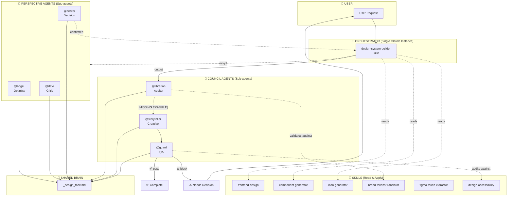

# MTR Design System - Agentic Architecture

> **Last Updated**: 2026-01-28
> **Status**: Active Development

## Overview

This document defines the agentic architecture for the MTR Design System. Claude should reference and update this diagram as the system evolves.

## Architecture Diagram

## Component Definitions

### Orchestrator
| Component | Type | Description |
|-----------|------|-------------|
| `design-system-builder` | Skill | Main orchestrator that coordinates all design system work |

### Skills (Read & Apply)
Skills are instruction sets that the orchestrator reads and applies. They don't spawn sub-agents.

| Skill | Purpose |
|-------|---------|
| `frontend-design` | UX design consultation and guidance |
| `component-generator` | Create production-ready React components |
| `icon-generator` | Create SVG icons with consistent conventions |
| `brand-tokens-translator` | Translate brand guidelines into design tokens |
| `figma-token-extractor` | Extract design tokens from Figma and integrate via design-system-builder |
| `design-accessibility` | Audit and fix accessibility issues |

### Perspective Agents (Sub-agents)
Spawned for risky or uncertain decisions. They debate and write to shared state.

| Agent | Role | Responsibility |
|-------|------|----------------|
| `@angel` | Optimist | Advocates for the approach, highlights benefits |
| `@devil` | Critic | Challenges assumptions, identifies risks |
| `@arbiter` | Decision | Synthesizes perspectives, makes final call |

### Council Agents (Sub-agents)
Sequential validation pipeline for outputs.

| Agent | Role | Responsibility |
|-------|------|----------------|
| `@librarian` | Auditor | Validates against brand tokens, checks consistency |
| `@storyteller` | Creative | Generates missing examples, documentation |
| `@guard` | QA | Final accessibility and quality audit |

### Shared State
| File | Purpose |
|------|---------|
| `_design_task.md` | Shared brain - all agents read/write context here |

## Flow Summary

1. **User** sends request to **Orchestrator**
2. **Orchestrator** reads relevant **Skills** for instructions
3. If decision is risky → spawn **Perspective Agents** for debate
4. **Arbiter** confirms decision → returns to **Orchestrator**
5. **Orchestrator** produces output → **Librarian** validates
6. **Librarian** finds missing examples → **Storyteller** generates
7. **Storyteller** output → **Guard** performs final QA
8. **Guard** passes → Complete | **Guard** blocks → User decides

## Change Log

| Date | Change | Author |
|------|--------|--------|
| 2026-01-28 | Initial architecture diagram | Claude |
| 2026-01-29 | Added figma-token-extractor skill | Claude |
