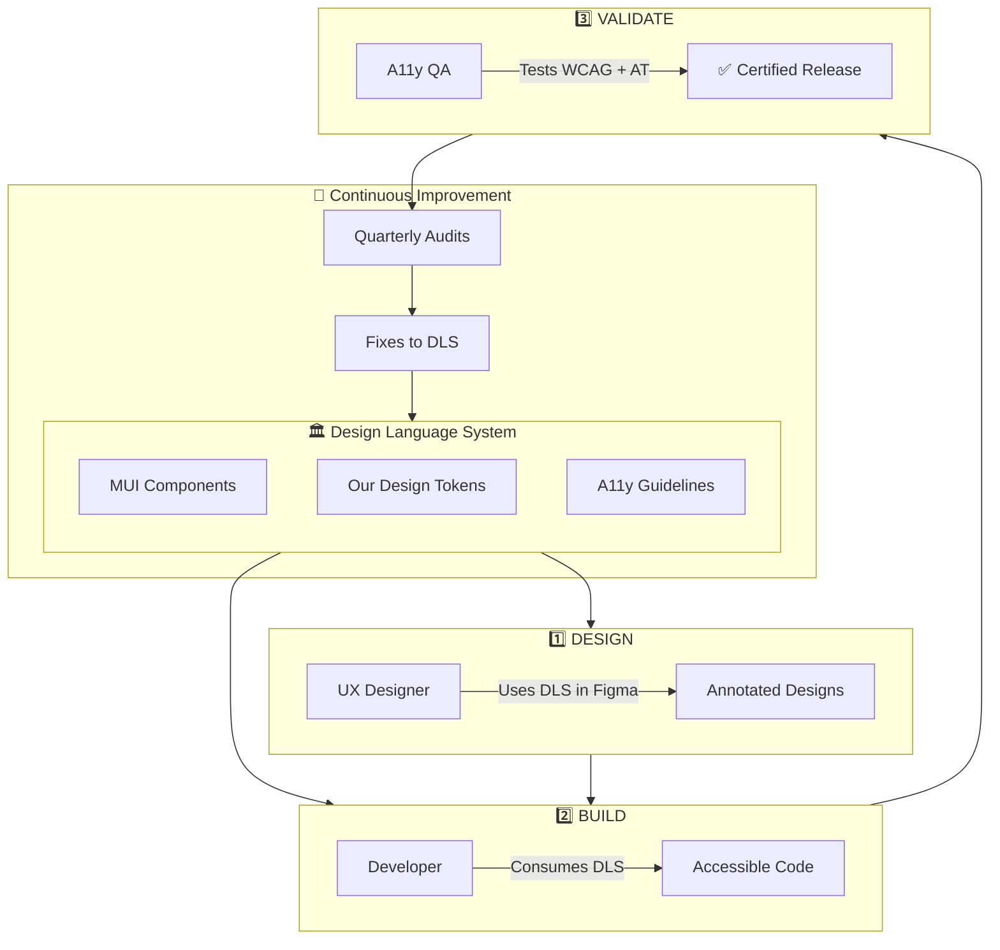

# Accessibility-First Product Lifecycle Strategy

**Prepared for:** CTO Review
**Date:** February 2026
**Objective:** Provide a fully accessible, consistent, and scalable solution for all products

---

## Executive Summary

This proposal outlines a strategy to embed accessibility into every phase of our product lifecycle. Our recommendation: **adopt Material UI with custom design tokens** as the foundation for a Design Language System (DLS) that delivers WCAG 2.2 AA compliance out of the box.

This approach gives us:
- **Immediate accessibility** — Battle-tested components with built-in keyboard, focus, and screen reader support
- **Brand consistency** — Our design tokens applied via MUI's theming system
- **Faster delivery** — 50+ production-ready components vs. 6-12 months building from scratch
- **Lower risk** — Proven accessibility patterns used by thousands of production apps

---

## Strategic Benefits

| Benefit | Impact |
|---------|--------|
| **Accessibility** | WCAG 2.2 AA compliance built into every component. Users with disabilities get equal access from day one. |
| **Scalability** | New products inherit accessibility automatically—no per-product remediation. As the portfolio grows, effort stays flat. |
| **Consistency** | Unified interaction patterns across all products reduce user friction and strengthen brand trust. |
| **Maintainability** | Updates apply once and propagate everywhere—reducing long-term cost and regression risk. |

These benefits compound over time: the more products that consume the DLS, the greater the return on the initial investment.

---

## 1. Current State

| Aspect | Today | With DLS |
|--------|-------|----------|
| **Technology** | HTML + CSS (no component library) | MUI + Custom Tokens |
| **Accessibility** | Ad-hoc fixes per product | Built-in to every component |
| **Reusability** | Styles duplicated across products | Single source of truth |
| **Testing** | Manual only | Automated + manual pipeline |
| **Documentation** | None centralized | A11y guidelines per component |

### The Opportunity

Since we don't have an existing component library, we can **build it right from the start**—with accessibility as a foundational requirement, not a retrofit.

---

## 2. Recommended Approach: Material UI + Custom Design Tokens

### Why MUI?

| What We Get | Why It Matters |
|-------------|----------------|
| **WCAG 2.1 AA compliant components** | Keyboard navigation, focus management, and ARIA handled automatically |
| **50+ production-ready components** | Buttons, forms, modals, tables, navigation—all accessible by default |
| **Powerful theming system** | Map our design tokens directly to MUI's theme provider |
| **Active maintenance** | MUI team handles accessibility updates as WCAG evolves |
| **Proven at scale** | Used by thousands of companies in production |

### How It Works

```
┌─────────────────────────────────────────────────────────────┐
│                    OUR DESIGN TOKENS                        │
│   Colors • Typography • Spacing • Shadows • Motion          │
└─────────────────────────┬───────────────────────────────────┘
                          │
                          ▼
┌─────────────────────────────────────────────────────────────┐
│                  MUI THEME PROVIDER                         │
│         Transforms tokens into MUI theme config             │
└─────────────────────────┬───────────────────────────────────┘
                          │
                          ▼
┌─────────────────────────────────────────────────────────────┐
│              BRANDED, ACCESSIBLE COMPONENTS                 │
│   Our look & feel + MUI's accessibility = Best of both      │
└─────────────────────────────────────────────────────────────┘
```

### Comparison: Build vs. Buy

| Factor | Build from Scratch | MUI + Custom Tokens |
|--------|-------------------|---------------------|
| **Time to first component** | 2-3 months | Days |
| **Full library ready** | 6-12+ months | 1-2 months |
| **A11y expertise required** | Deep (hire specialists) | Moderate (learn theming) |
| **Risk of a11y gaps** | High | Low |
| **Ongoing maintenance** | We own it all | MUI handles core |
| **Brand customization** | 100% | 90-95% |
| **Bundle size** | Minimal | Larger (tree-shaking helps) |

**Recommendation:** The speed and accessibility benefits of MUI far outweigh the minor trade-offs in control and bundle size.

---

## 3. Accessibility-Integrated Workflow

### Workflow Overview



### Phase-by-Phase Ownership

| Phase | Who | Does What | Output |
|-------|-----|-----------|--------|
| **Design** | UX | Annotates designs with a11y specs using DLS components | Accessible design specs |
| **Build** | Dev | Implements using MUI + tokens (no custom a11y code needed) | Accessible code |
| **Validate** | QA | Tests against WCAG criteria and assistive technologies | Certified release |

### What Each Role Delivers

**UX Designer**
- Annotates: heading hierarchy, tab order, focus states, alt text
- Uses DLS components in Figma (synced from MUI)
- Ensures color contrast ratios meet WCAG AA

**Developer**
- Pulls components from DLS—does not recreate
- Follows usage guidelines for each component
- Tests with keyboard during development

**A11y QA**
- Runs automated tests (axe-core, Lighthouse)
- Manual testing: keyboard, screen readers (VoiceOver, NVDA), zoom, high contrast
- Documents any gaps for remediation

---

## 4. Training Program

Accessibility is a shared responsibility. All roles should complete training within 6 months.

| Role | Focus Areas |
|------|-------------|
| **Developers** | MUI theming, ARIA patterns, keyboard testing |
| **UX Designers** | Inclusive design, annotation standards, contrast |
| **Product Managers** | WCAG requirements, compliance, prioritization |
| **QA Engineers** | Assistive tech testing, reporting, tooling |

*See Appendix A for recommended resources (free and paid).*

---

## 5. Supporting Practices

### 5.1 Shift-Left Testing
- **IDE plugins** (axe DevTools) catch issues during coding
- **PR checks** run automated a11y tests before merge
- **Design review gates** require a11y annotation approval

### 5.2 Accessibility Champions
Designate 1-2 people per team:
- First point of contact for a11y questions
- Conduct internal reviews before QA handoff
- Deeper training investment

### 5.3 CI/CD Integration
- axe-core or pa11y in build pipeline
- Block merges on critical violations
- Generate a11y reports per release

### 5.4 Acceptance Criteria
Add to every user story:
- [ ] Keyboard accessible
- [ ] Screen reader compatible
- [ ] WCAG 2.2 AA contrast
- [ ] Visible focus states
- [ ] Respects reduced motion preference

---

## 6. Success Metrics

| Metric | Target |
|--------|--------|
| Automated a11y test pass rate | 100% critical/serious |
| WCAG 2.2 AA conformance | Full conformance |
| Time to remediate a11y bugs | < 1 sprint |
| Team training completion | 100% within 6 months |
| DLS adoption (Canopy) | 100% of components |

---

## Summary

**The recommendation:** Adopt Material UI with our custom design tokens to build an accessible Design Language System.

**Why this approach wins:**
1. **Immediate accessibility** — MUI components are WCAG compliant out of the box
2. **Faster time-to-market** — Weeks, not months, to production-ready components
3. **Lower risk** — Battle-tested a11y patterns vs. building our own
4. **Sustainable** — MUI maintains accessibility; we maintain brand

**Key Takeaways:**
- DLS is the multiplier—fix once, benefit everywhere
- MUI gives us accessibility for free; we add brand via tokens
- Training + process ensures accessibility is everyone's job
- Automate early, measure constantly

---

*Ready to discuss implementation details and resource allocation.*

---

## Appendix A: Training Resources

### Free Resources
- [W3C Web Accessibility Initiative (WAI)](https://www.w3.org/WAI/tutorials/) — Tutorials and guidelines
- [Google web.dev Accessibility](https://web.dev/accessibility) — Developer learning path
- [A11y Project Checklist](https://www.a11yproject.com/checklist/) — Practical checklist
- [MUI Accessibility Docs](https://mui.com/material-ui/guides/accessibility/) — Component-specific guidance

### Paid/Certification
- **Deque University** — Role-based training tracks
- **IAAP CPACC/WAS** — Industry certifications
- **Stark Academy** — Design-focused training
