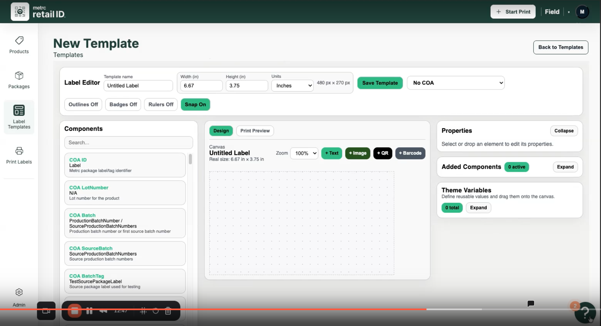

# Accessibility Compliance Report

## Retail ID - Label Template Editor

| Field | Value |
|-------|-------|
| **Audit Date** | January 29, 2026 |
| **Standard** | WCAG 2.2 Level AA |
| **Auditor** | MTR Design System - Accessibility Skill |
| **Page/Feature** | Label Template Editor (New Template View) |

---

## Executive Summary

The Label Template Editor interface was evaluated against WCAG 2.2 Level AA success criteria. The audit identified **8 accessibility issues** that require remediation.

### Issue Summary by Severity

| Severity | Count | Status |
|----------|-------|--------|
| Serious | 3 | Must fix before release |
| Moderate | 3 | Fix in next iteration |
| Minor | 2 | Recommended improvements |

### Overall Compliance Status: **Needs Remediation**

Primary issues are related to semantic markup, ARIA states, and focus management.

---

## Screenshot Under Review



*Figure 1: Retail ID Label Template Editor - New Template view*

---

## Detailed Findings

### Serious Issues

#### ISSUE-001: Form Labels Not Programmatically Associated

| Attribute | Details |
|-----------|---------|
| **Severity** | Serious |
| **WCAG Criteria** | 1.3.1 Info and Relationships, 3.3.2 Labels or Instructions |
| **Location** | Label Editor section - Template name, Width, Height, Units fields |
| **Current State** | Labels appear visually above inputs but may not be programmatically associated |
| **Impact** | Screen reader users may not understand input purpose |

**Recommendation:**
```html
<label for="template-name">Template name</label>
<input type="text" id="template-name" name="templateName" />

<label for="width">Width (in)</label>
<input type="text" id="width" name="width" />
```

---

#### ISSUE-002: Component List Items Missing Semantic Markup

| Attribute | Details |
|-----------|---------|
| **Severity** | Serious |
| **WCAG Criteria** | 4.1.2 Name, Role, Value |
| **Location** | Components panel - COA ID, COA LotNumber, COA Batch items |
| **Current State** | Interactive/draggable elements without clear role indication |
| **Impact** | Assistive technology cannot convey item purpose or drag-and-drop capability |

**Recommendation:**
```html
<button
  type="button"
  class="component-item"
  aria-label="COA ID - Metrc package label identifier. Drag to add to canvas."
  draggable="true"
  aria-grabbed="false"
>
  <span class="component-name">COA ID</span>
  <span class="component-description">Metrc package label/tag identifier</span>
</button>
```

---

#### ISSUE-003: Left Navigation Accessibility

| Attribute | Details |
|-----------|---------|
| **Severity** | Serious |
| **WCAG Criteria** | 1.1.1 Non-text Content, 2.4.6 Headings and Labels |
| **Location** | Left sidebar - Products, Packages, Label Templates, Print Labels, Admin |
| **Current State** | Icons with text labels need proper ARIA handling |

**Recommendation:**
```html
<nav aria-label="Main navigation">
  <ul role="list">
    <li>
      <a href="/label-templates" aria-current="page">
        <svg aria-hidden="true" focusable="false">...</svg>
        <span>Label Templates</span>
      </a>
    </li>
  </ul>
</nav>
```

---

### Moderate Issues

#### ISSUE-004: View Toggle Missing ARIA State

| Attribute | Details |
|-----------|---------|
| **Severity** | Moderate |
| **WCAG Criteria** | 4.1.2 Name, Role, Value |
| **Location** | Canvas area - "Design" and "Print Preview" toggle buttons |
| **Current State** | Visual distinction exists but ARIA state not communicated |

**Recommendation:**
```html
<div role="group" aria-label="Editor view">
  <button type="button" aria-pressed="true">Design</button>
  <button type="button" aria-pressed="false">Print Preview</button>
</div>
```

---

#### ISSUE-005: Search Field Needs Accessible Label

| Attribute | Details |
|-----------|---------|
| **Severity** | Moderate |
| **WCAG Criteria** | 3.3.2 Labels or Instructions |
| **Location** | Components panel - "Search..." input field |
| **Current State** | Placeholder-only label |

**Recommendation:**
```html
<label for="component-search" class="visually-hidden">Search components</label>
<input type="search" id="component-search" placeholder="Search..." />
```

---

#### ISSUE-006: Panel Focus Management

| Attribute | Details |
|-----------|---------|
| **Severity** | Moderate |
| **WCAG Criteria** | 2.4.3 Focus Order, 2.1.2 No Keyboard Trap |
| **Location** | Right side - In-App Guides panel (if present) |
| **Current State** | Focus management on panel open/close needs verification |

**Recommendation:**
```javascript
function openPanel() {
  panel.setAttribute('aria-hidden', 'false');
  closeButton.focus();
}

function closePanel() {
  panel.setAttribute('aria-hidden', 'true');
  triggerButton.focus();
}

panel.addEventListener('keydown', (e) => {
  if (e.key === 'Escape') closePanel();
});
```

---

### Minor Issues

#### ISSUE-007: Collapse Button Missing aria-expanded

| Attribute | Details |
|-----------|---------|
| **Severity** | Minor |
| **WCAG Criteria** | 4.1.2 Name, Role, Value |
| **Location** | Properties panel - "Collapse" button |

**Recommendation:**
```html
<button type="button" aria-expanded="true" aria-controls="properties-content">
  Collapse
</button>
```

---

#### ISSUE-008: Zoom Dropdown Accessibility

| Attribute | Details |
|-----------|---------|
| **Severity** | Minor |
| **WCAG Criteria** | 4.1.2 Name, Role, Value, 2.1.1 Keyboard |
| **Location** | Canvas toolbar - "100%" zoom dropdown |

**Recommendation:**
```html
<label for="zoom-select" class="visually-hidden">Zoom level</label>
<select id="zoom-select">
  <option value="50">50%</option>
  <option value="100" selected>100%</option>
  <option value="150">150%</option>
</select>
```

---

## Passed Checks

| Criteria | Status |
|----------|--------|
| Page has visible heading structure ("New Template") | Pass |
| Header navigation has adequate contrast | Pass |
| Left navigation includes text labels with icons | Pass |
| Canvas work area has clear visual boundaries | Pass |
| "Back to Templates" link is readable | Pass |
| Button text is readable (dark text on green background) | Pass |
| Primary action buttons are visually distinguishable | Pass |

---

## Remediation Priority

### Phase 1: Serious (Before Release)
1. Add form label associations (ISSUE-001)
2. Add semantic markup to component list (ISSUE-002)
3. Improve navigation accessibility (ISSUE-003)

### Phase 2: Moderate (Within 2 Weeks)
4. Add ARIA states to view toggle (ISSUE-004)
5. Add accessible label to search field (ISSUE-005)
6. Implement focus management for panels (ISSUE-006)

### Phase 3: Minor (Next Iteration)
7. Add aria-expanded to collapse button (ISSUE-007)
8. Verify zoom dropdown accessibility (ISSUE-008)

---

## Testing Recommendations

### Automated Testing
- [ ] Run axe-core on all page states
- [ ] Add automated accessibility checks to CI/CD pipeline

### Manual Testing
- [ ] Keyboard-only navigation test
- [ ] Screen reader testing (NVDA, JAWS, VoiceOver)
- [ ] High contrast mode verification

---

## Report Information

| Field | Value |
|-------|-------|
| **Report Version** | 2.0 |
| **Generated** | 2026-01-29 |
| **Tool** | MTR Design System Accessibility Audit |
| **Standard** | WCAG 2.2 Level AA |
| **Methodology** | Visual inspection + heuristic evaluation |

---

*This report was generated by the MTR Design System Accessibility Skill.*
